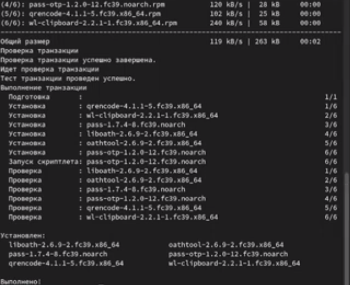
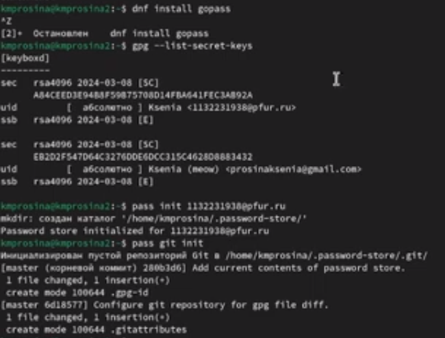
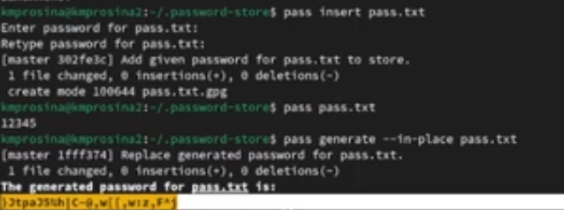
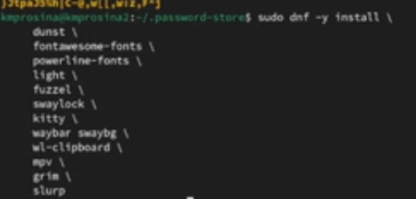
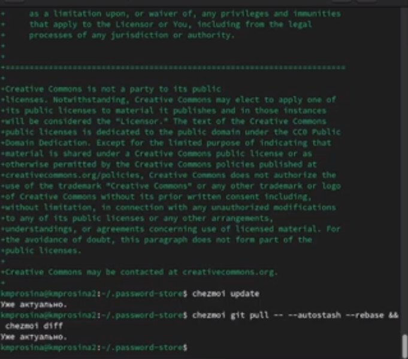
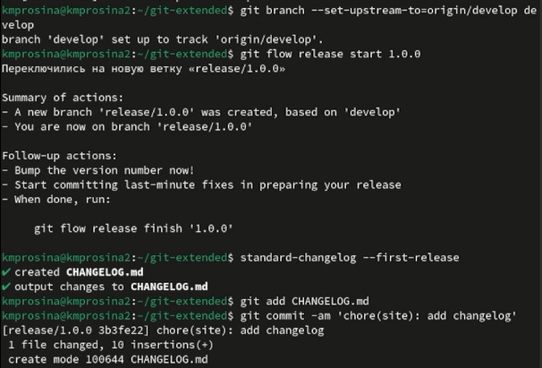

---
## Front matter
lang: ru-RU
title: Отчёт о выполнении
subtitle: Лабораторная работа № 5
author:
  - Просина К. М.
institute:
  - Российский университет дружбы народов, Москва, Россия
date: 08 марта 2024

## i18n babel
babel-lang: russian
babel-otherlangs: english

## Formatting pdf
toc: false
toc-title: Содержание
slide_level: 2
aspectratio: 169
section-titles: true
theme: metropolis
header-includes:
 - \metroset{progressbar=frametitle,sectionpage=progressbar,numbering=fraction}
 - '\makeatletter'
 - '\beamer@ignorenonframefalse'
 - '\makeatother'
 ## Fonts
mainfont: PT Serif
romanfont: PT Serif
sansfont: PT Sans
monofont: PT Mono
mainfontoptions: Ligatures=TeX
romanfontoptions: Ligatures=TeX
sansfontoptions: Ligatures=TeX,Scale=MatchLowercase
monofontoptions: Scale=MatchLowercase,Scale=0.9
---

# Информация

## Докладчик

:::::::::::::: {.columns align=center}
::: {.column width="70%"}

  * Просина Ксения Максимовна
  * студентка Российского университета дружбы народов

:::
::: {.column width="30%"}
:::
::::::::::::::

# Вводная часть

## Цель работы

- Целью лабораторной работы является получение практических навыков правильной работы с репозиториями git.

# Выполнение лабораторной работы

## Выполнение лабораторной работы

Устанавливаем pass

{#fig:001 width=70%}

## Выполнение лабораторной работы

Настраиваем ключи GPG и инициализируем хранилище, после чего синхронизируемся с git

{#fig:002 width=70%}

## Выполнение лабораторной работы

Настройка интерфейса с броузером

Добавляем и сохраняем пароль

{#fig:003 width=70%}

## Выполнение лабораторной работы

Управление файлами конфигурации. Дополнительное программное обеспечение

Устанавливаем дополнительное программное обеспечение и шрифты:

{#fig:004 width=70%}

## Выполнение лабораторной работы

Создаем собственный репозиторий с помощью утилит и подключаем репозиторий к своей системе

{#fig:005 width=70%}

## Выполнение лабораторной работы

Ежедневные операции c chezmoi

Извлекаем последние изменения из репозитория и применяем их

{#fig:008 width=70%}

## Выполнение лабораторной работы

Извлекаем последние изменения из своего репозитория и смотрим, что изменится, фактически не применяя изменения

{#fig:009 width=70%}

## Выводы

- Во время выполнения лабораторной работы мне удалось получить навыки правильной работы с репозиториями git.

