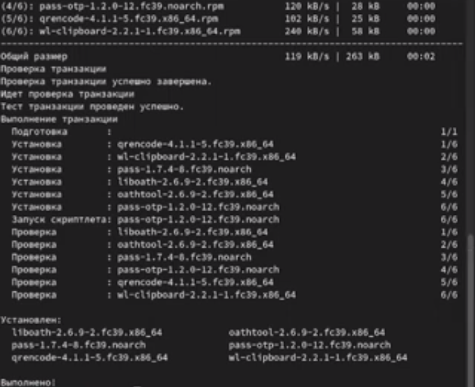
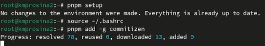
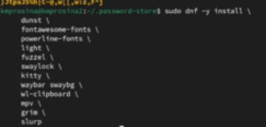
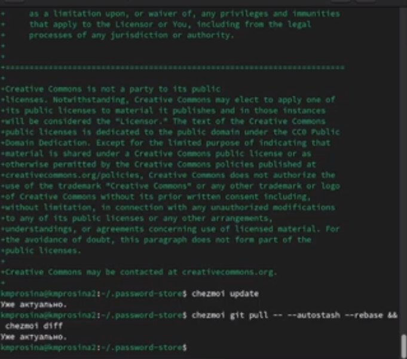
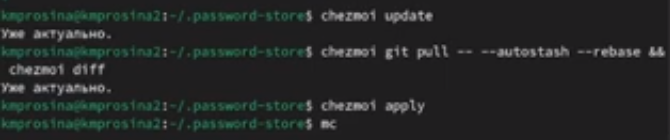
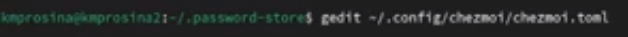

---
## Front matter
title: "Отчёт о выполнении"
subtitle: "Лабораторная работа № 4"
author: "Просина К. М."

## Generic otions
lang: ru-RU
toc-title: "Содержание"

## Bibliography
bibliography: bib/cite.bib
csl: pandoc/csl/gost-r-7-0-5-2008-numeric.csl

## Pdf output format
toc: true # Table of contents
toc-depth: 2
lof: true # List of figures
lot: true # List of tables
fontsize: 12pt
linestretch: 1.5
papersize: a4
documentclass: scrreprt
## I18n polyglossia
polyglossia-lang:
  name: russian
  options:
	- spelling=modern
	- babelshorthands=true
polyglossia-otherlangs:
  name: english
## I18n babel
babel-lang: russian
babel-otherlangs: english
## Fonts
mainfont: PT Serif
romanfont: PT Serif
sansfont: PT Sans
monofont: PT Mono
mainfontoptions: Ligatures=TeX
romanfontoptions: Ligatures=TeX
sansfontoptions: Ligatures=TeX,Scale=MatchLowercase
monofontoptions: Scale=MatchLowercase,Scale=0.9
## Biblatex
biblatex: true
biblio-style: "gost-numeric"
biblatexoptions:
  - parentracker=true
  - backend=biber
  - hyperref=auto
  - language=auto
  - autolang=other*
  - citestyle=gost-numeric
## Pandoc-crossref LaTeX customization
figureTitle: "Рис."
tableTitle: "Таблица"
listingTitle: "Листинг"
lofTitle: "Список иллюстраций"
lotTitle: "Список таблиц"
lolTitle: "Листинги"
## Misc options
indent: true
header-includes:
  - \usepackage{indentfirst}
  - \usepackage{float} # keep figures where there are in the text
  - \floatplacement{figure}{H} # keep figures where there are in the text
---

# Цель работы

Во время выполнения лабораторной работы получить навыки настройки рабочей среды

# Теоретическое введение

## Автоматически создавать файл конфигурации на новой машине

При выполнении chezmoi init также может автоматически создать файл конфигурации, если он еще не существует.
Если ваш репозиторий содержит файл с именем .chezmoi.$FORMAT.tmpl, где $FORMAT есть один из поддерживаемых форматов файла конфигурации (json, toml, или yaml), то chezmoi init выполнит этот шаблон для создания исходного файла конфигурации.
Например, пусть ~/.local/share/chezmoi/.chezmoi.toml.tmpl выглядит так:
{{- $email := promptStringOnce . "email" "Email address" -}}

[data]
email = {{ $email | quote }}

При выполнении chezmoi init будет создан конфигурационный файл ~/.config/chezmoi/chezmoi.toml.
promptStringOnce — это специальная функция, которая запрашивает у пользователя значение, если оно еще не установлено в разделе data конфигурационного файла.

Чтобы протестировать этот шаблон, используйте chezmoi execute-template с флагами --init и --promptString, например:

chezmoi execute-template --init --promptString email=me@home.org < ~/.local/share/

# Выполнение лабораторной работы

## Менеджер паролей pass

Устанавливаем pass

{#fig:001 width=70%}

Настраиваем ключи GPG и инициализируем хранилище, после чего синхронизируемся с git

{#fig:002 width=70%}

## Настройка интерфейса с броузером

Добавляем и сохраняем пароль

{#fig:003 width=70%}

## Управление файлами конфигурации

### Дополнительное программное обеспечение

Устанавливаем дополнительное программное обеспечение и шрифты:

{#fig:004 width=70%}

Создаем собственный репозиторий с помощью утилит и подключаем репозиторий к своей системе

{#fig:005 width=70%}

## Ежедневные операции c chezmoi

Извлекаем последние изменения из репозитория и применяем их

{#fig:008 width=70%}

Извлекаем последние изменения из своего репозитория и смотрим, что изменится, фактически не применяя изменения

{#fig:009 width=70%}

# Выводы

Во время выполнения лабораторной работы мне удалось получить навыки настройки рабочей среды

# Список литературы{.unnumbered}

::: {#https://esystem.rudn.ru/mod/page/view.php?id=1098939}
:::
