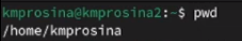
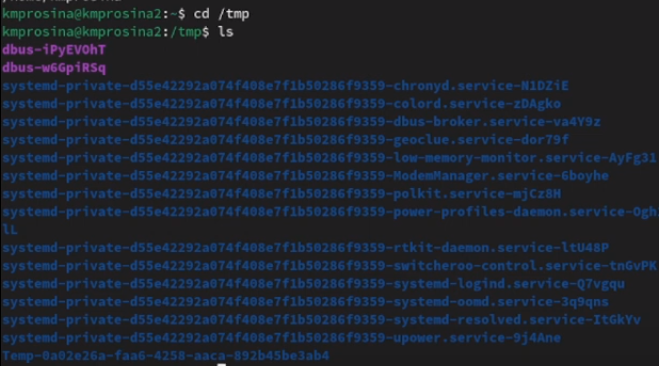
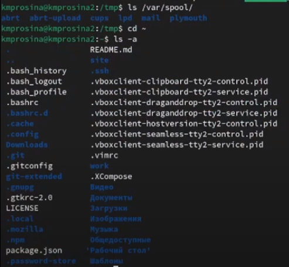
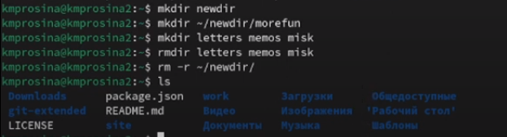
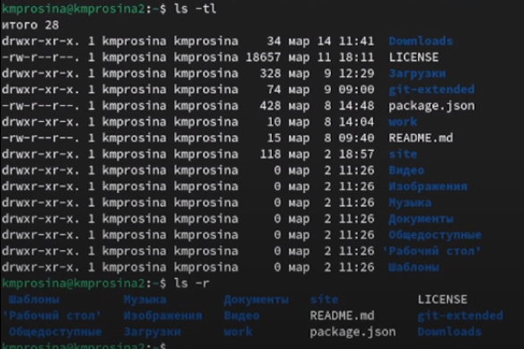

---
## Front matter
lang: ru-RU
title: Отчёт о выполнении
subtitle: Лабораторная работа № 6
author:
  - Просина К. М.
institute:
  - Российский университет дружбы народов, Москва, Россия
date: 08 марта 2024

## i18n babel
babel-lang: russian
babel-otherlangs: english

## Formatting pdf
toc: false
toc-title: Содержание
slide_level: 2
aspectratio: 169
section-titles: true
theme: metropolis
header-includes:
 - \metroset{progressbar=frametitle,sectionpage=progressbar,numbering=fraction}
 - '\makeatletter'
 - '\beamer@ignorenonframefalse'
 - '\makeatother'
 ## Fonts
mainfont: PT Serif
romanfont: PT Serif
sansfont: PT Sans
monofont: PT Mono
mainfontoptions: Ligatures=TeX
romanfontoptions: Ligatures=TeX
sansfontoptions: Ligatures=TeX,Scale=MatchLowercase
monofontoptions: Scale=MatchLowercase,Scale=0.9
---

# Информация

## Докладчик

:::::::::::::: {.columns align=center}
::: {.column width="70%"}

  * Просина Ксения Максимовна
  * студентка Российского университета дружбы народов

:::
::: {.column width="30%"}
:::
::::::::::::::

# Вводная часть

## Цель работы

Приобретение практических навыков взаимодействия пользователя с системой по-
средством командной строки.

# Выполнение лабораторной работы

## Выполнение лабораторной работы

1. Определите полное имя вашего домашнего каталога. Далее относительно этого каталога будут выполняться последующие упражнения.

{#fig:001 width=70%}

## Выполнение лабораторной работы

2. Выполните следующие действия:
2.1. Перейдите в каталог /tmp.
2.2. Выведите на экран содержимое каталога /tmp. Для этого используйте команду ls с различными опциями. Поясните разницу в выводимой на экран информации.

{#fig:002 width=70%}

## Выполнение лабораторной работы

2.3. Определите, есть ли в каталоге /var/spool подкаталог с именем cron?
2.4. Перейдите в Ваш домашний каталог и выведите на экран его содержимое. Опре-
делите, кто является владельцем файлов и подкаталогов?

{#fig:003 width=70%}

## Выполнение лабораторной работы

3. Выполните следующие действия:
3.1. В домашнем каталоге создайте новый каталог с именем newdir.
3.2. В каталоге ~/newdir создайте новый каталог с именем morefun.
3.3. В домашнем каталоге создайте одной командой три новых каталога с именами
letters, memos, misk. Затем удалите эти каталоги одной командой.
3.4. Попробуйте удалить ранее созданный каталог ~/newdir командой rm. Проверьте,
был ли каталог удалён.
3.5. Удалите каталог ~/newdir/morefun из домашнего каталога. Проверьте, был ли
каталог удалён.

{#fig:004 width=70%}

## Выполнение лабораторной работы

4. С помощью команды man определите, какую опцию команды ls нужно использо-
вать для просмотра содержимое не только указанного каталога, но и подкаталогов,
входящих в него.
5. С помощью команды man определите набор опций команды ls, позволяющий отсортировать по времени последнего изменения выводимый список содержимого каталога с развёрнутым описанием файлов.

{#fig:005 width=70%}

## Выполнение лабораторной работы

6. Используйте команду man для просмотра описания следующих команд: cd, pwd, mkdir,
rmdir, rm. Поясните основные опции этих команд.
7. Используя информацию, полученную при помощи команды history, выполните мо-
дификацию и исполнение нескольких команд из буфера команд.

{#fig:006 width=70%}

## Выводы

В ходе выполнения работы были приобретены практические навыки взаимодействия пользователя с системой посредством командной строки.

