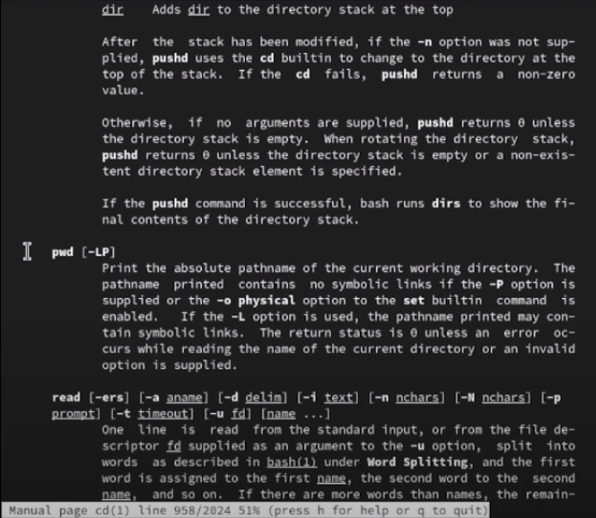

---
## Front matter
title: "Отчёт о выполнении"
subtitle: "Лабораторная работа № 6"
author: "Просина К. М."

## Generic otions
lang: ru-RU
toc-title: "Содержание"

## Bibliography
bibliography: bib/cite.bib
csl: pandoc/csl/gost-r-7-0-5-2008-numeric.csl

## Pdf output format
toc: true # Table of contents
toc-depth: 2
lof: true # List of figures
lot: true # List of tables
fontsize: 12pt
linestretch: 1.5
papersize: a4
documentclass: scrreprt
## I18n polyglossia
polyglossia-lang:
  name: russian
  options:
	- spelling=modern
	- babelshorthands=true
polyglossia-otherlangs:
  name: english
## I18n babel
babel-lang: russian
babel-otherlangs: english
## Fonts
mainfont: PT Serif
romanfont: PT Serif
sansfont: PT Sans
monofont: PT Mono
mainfontoptions: Ligatures=TeX
romanfontoptions: Ligatures=TeX
sansfontoptions: Ligatures=TeX,Scale=MatchLowercase
monofontoptions: Scale=MatchLowercase,Scale=0.9
## Biblatex
biblatex: true
biblio-style: "gost-numeric"
biblatexoptions:
  - parentracker=true
  - backend=biber
  - hyperref=auto
  - language=auto
  - autolang=other*
  - citestyle=gost-numeric
## Pandoc-crossref LaTeX customization
figureTitle: "Рис."
tableTitle: "Таблица"
listingTitle: "Листинг"
lofTitle: "Список иллюстраций"
lotTitle: "Список таблиц"
lolTitle: "Листинги"
## Misc options
indent: true
header-includes:
  - \usepackage{indentfirst}
  - \usepackage{float} # keep figures where there are in the text
  - \floatplacement{figure}{H} # keep figures where there are in the text
---

# Цель работы

Приобретение практических навыков взаимодействия пользователя с системой по-
средством командной строки.

# Теоретическое введение

4.2. Указания к работе
В операционной системе типа Linux взаимодействие пользователя с системой обычно
осуществляется с помощью командной строки посредством построчного ввода ко-
манд. При этом обычно используется командные интерпретаторы языка shell: /bin/sh;
/bin/csh; /bin/ksh.
Формат команды. Командой в операционной системе называется записанный по
специальным правилам текст (возможно с аргументами), представляющий собой ука-
зание на выполнение какой-либо функций (или действий) в операционной системе.
Обычно первым словом идёт имя команды, остальной текст — аргументы или опции,
конкретизирующие действие.
Общий формат команд можно представить следующим образом:
<имя_команды><разделитель><аргументы>
Команда man. Команда man используется для просмотра (оперативная помощь) в диа-
логовом режиме руководства (manual) по основным командам операционной системы
типа Linux.
Формат команды:
man <команда>
Пример (вывод информации о команде man):
1 man man
Для управления просмотром результата выполнения команды man можно использовать
следующие клавиши:
– Space — перемещение по документу на одну страницу вперёд;
– Enter — перемещение по документу на одну строку вперёд;
– q — выход из режима просмотра описания.
Команда cd. Команда cd используется для перемещения по файловой системе опера-
ционной системы типа Linux.
Замечание 1. Файловая система ОС типа Linux — иерархическая система каталогов,
подкаталогов и файлов, которые обычно организованы и сгруппированы по функ-
циональному признаку. Самый верхний каталог в иерархии называется корневым
и обозначается символом /. Корневой каталог содержит системные файлы и другие
каталоги.
Формат команды:
cd [путь_к_каталогу]

# Выполнение лабораторной работы

1. Определите полное имя вашего домашнего каталога. Далее относительно этого каталога будут выполняться последующие упражнения.

{#fig:001 width=70%}

2. Выполните следующие действия:
2.1. Перейдите в каталог /tmp.
2.2. Выведите на экран содержимое каталога /tmp. Для этого используйте команду ls с различными опциями. Поясните разницу в выводимой на экран информации.

{#fig:002 width=70%}

2.3. Определите, есть ли в каталоге /var/spool подкаталог с именем cron?
2.4. Перейдите в Ваш домашний каталог и выведите на экран его содержимое. Опре-
делите, кто является владельцем файлов и подкаталогов?

{#fig:003 width=70%}

3. Выполните следующие действия:
3.1. В домашнем каталоге создайте новый каталог с именем newdir.
3.2. В каталоге ~/newdir создайте новый каталог с именем morefun.
3.3. В домашнем каталоге создайте одной командой три новых каталога с именами
letters, memos, misk. Затем удалите эти каталоги одной командой.
3.4. Попробуйте удалить ранее созданный каталог ~/newdir командой rm. Проверьте,
был ли каталог удалён.
3.5. Удалите каталог ~/newdir/morefun из домашнего каталога. Проверьте, был ли
каталог удалён.

{#fig:004 width=70%}

4. С помощью команды man определите, какую опцию команды ls нужно использо-
вать для просмотра содержимое не только указанного каталога, но и подкаталогов,
входящих в него.
5. С помощью команды man определите набор опций команды ls, позволяющий отсортировать по времени последнего изменения выводимый список содержимого каталога с развёрнутым описанием файлов.

{#fig:005 width=70%}

6. Используйте команду man для просмотра описания следующих команд: cd, pwd, mkdir,
rmdir, rm. Поясните основные опции этих команд.
7. Используя информацию, полученную при помощи команды history, выполните мо-
дификацию и исполнение нескольких команд из буфера команд.

{#fig:006 width=70%}

# Выводы

В ходе выполнения работы были приобретены практические навыки взаимодействия пользователя с системой посредством командной строки.

# Список литературы{.unnumbered}

::: file:///home/kmprosina/Downloads/004-lab_shell-1.pdf
:::
