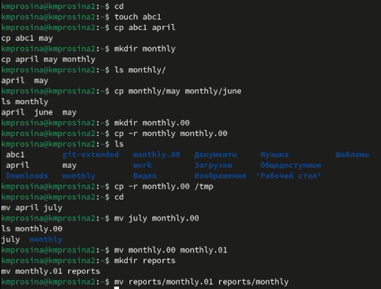
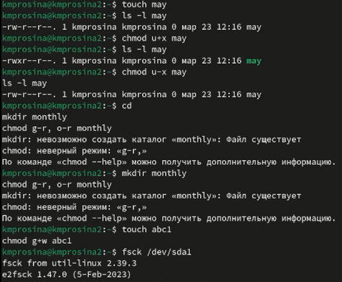
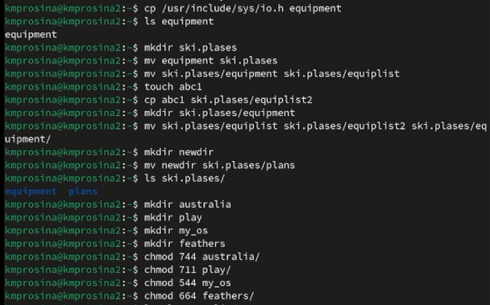
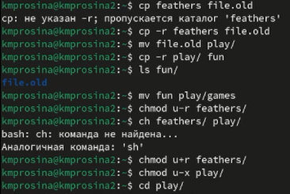

---
## Front matter
title: "Отчёт о выполнении"
subtitle: "Лабораторная работа № 7"
author: "Просина К. М."

## Generic otions
lang: ru-RU
toc-title: "Содержание"

## Bibliography
bibliography: bib/cite.bib
csl: pandoc/csl/gost-r-7-0-5-2008-numeric.csl

## Pdf output format
toc: true # Table of contents
toc-depth: 2
lof: true # List of figures
lot: true # List of tables
fontsize: 12pt
linestretch: 1.5
papersize: a4
documentclass: scrreprt
## I18n polyglossia
polyglossia-lang:
  name: russian
  options:
	- spelling=modern
	- babelshorthands=true
polyglossia-otherlangs:
  name: english
## I18n babel
babel-lang: russian
babel-otherlangs: english
## Fonts
mainfont: PT Serif
romanfont: PT Serif
sansfont: PT Sans
monofont: PT Mono
mainfontoptions: Ligatures=TeX
romanfontoptions: Ligatures=TeX
sansfontoptions: Ligatures=TeX,Scale=MatchLowercase
monofontoptions: Scale=MatchLowercase,Scale=0.9
## Biblatex
biblatex: true
biblio-style: "gost-numeric"
biblatexoptions:
  - parentracker=true
  - backend=biber
  - hyperref=auto
  - language=auto
  - autolang=other*
  - citestyle=gost-numeric
## Pandoc-crossref LaTeX customization
figureTitle: "Рис."
tableTitle: "Таблица"
listingTitle: "Листинг"
lofTitle: "Список иллюстраций"
lotTitle: "Список таблиц"
lolTitle: "Листинги"
## Misc options
indent: true
header-includes:
  - \usepackage{indentfirst}
  - \usepackage{float} # keep figures where there are in the text
  - \floatplacement{figure}{H} # keep figures where there are in the text
---

# Цель работы

Ознакомление с файловой системой Linux, её структурой, именами и содержанием
каталогов. Приобретение практических навыков по применению команд для работы
с файлами и каталогами, по управлению процессами (и работами), по проверке использования диска и обслуживанию файловой системы.

# Теоретическое введение

## Команды для работы с файлами и каталогами

Для создания текстового файла можно использовать команду touch.
Формат команды:
1 touch имя-файла
Для просмотра файлов небольшого размера можно использовать команду cat.
Формат команды:
1 cat имя-файла
Для просмотра файлов постранично удобнее использовать команду less.
Формат команды:
1 less имя-файла
Следующие клавиши используются для управления процессом просмотра:
– Space — переход к следующей странице,
– ENTER — сдвиг вперёд на одну строку,
– b — возврат на предыдущую страницу,
– h — обращение за подсказкой,
– q — выход из режима просмотра файла.
Команда head выводит по умолчанию первые 10 строк файла.
Формат команды:
1 head [-n] имя-файла,
где n — количество выводимых строк.
Команда tail выводит умолчанию 10 последних строк файла.
Формат команды:
1 tail [-n] имя-файла,
где n — количество выводимых строк.

## Копирование файлов и каталогов

Команда cp используется для копирования файлов и каталогов.
Формат команды:
1 cp [-опции] исходный_файл целевой_файл
Примеры:
1. Копирование файла в текущем каталоге. Скопировать файл ~/abc1 в файл april
и в файл may:
1 cd
2 touch abc1
3 cp abc1 april
4 cp abc1 may
2. Копирование нескольких файлов в каталог. Скопировать файлы april и may в каталог
monthly:
1 mkdir monthly
2 cp april may monthly
3. Копирование файлов в произвольном каталоге. Скопировать файл monthly/may в файл
с именем june:
1 cp monthly/may monthly/june
2 ls monthly
Опция i в команде cp выведет на экран запрос подтверждения о перезаписи файла.
Для рекурсивного копирования каталогов, содержащих файлы, используется команда
cp с опцией r.
Примеры:
1. Копирование каталогов в текущем каталоге. Скопировать каталог monthly в каталог
monthly.00:
1 mkdir monthly.00
2 cp -r monthly monthly.00
2. Копирование каталогов в произвольном каталоге. Скопировать каталог monthly.00
в каталог /tmp
1 cp -r monthly.00 /tmp

## Перемещение и переименование файлов и каталогов

Команды mv и mvdir предназначены для перемещения и переименования файлов
и каталогов.
Формат команды mv:
1 mv [-опции] старый_файл новый_файл
Примеры:
1. Переименование файлов в текущем каталоге. Изменить название файла april на
july в домашнем каталоге:
1 cd
2 mv april july
2. Перемещение файлов в другой каталог. Переместить файл july в каталог monthly.00:
1 mv july monthly.00
2 ls monthly.00
Результат:
1 april july june may
Если необходим запрос подтверждения о перезаписи файла, то нужно использовать
опцию i.
3. Переименование каталогов в текущем каталоге. Переименовать каталог monthly.00
в monthly.01
1 mv monthly.00 monthly.01
4. Перемещение каталога в другой каталог. Переместить каталог monthly.01в каталог
reports:
1 mkdir reports
2 mv monthly.01 reports
5. Переименование каталога, не являющегося текущим. Переименовать каталог
reports/monthly.01 в reports/monthly:
1 mv reports/monthly.01 reports/monthly

# Выполнение лабораторной работы

1. Выполните все примеры, приведённые в первой части описания лабораторной работы.

{#fig:001 width=70%}

2. Выполните следующие действия, зафиксировав в отчёте по лабораторной работе
используемые при этом команды и результаты их выполнения:
2.1. Скопируйте файл /usr/include/sys/io.h в домашний каталог и назовите его
equipment. Если файла io.h нет, то используйте любой другой файл в каталоге
/usr/include/sys/ вместо него.
2.2. В домашнем каталоге создайте директорию ~/ski.plases.
2.3. Переместите файл equipment в каталог ~/ski.plases.
2.4. Переименуйте файл ~/ski.plases/equipment в ~/ski.plases/equiplist.
2.5. Создайте в домашнем каталоге файл abc1 и скопируйте его в каталог
~/ski.plases, назовите его equiplist2.
2.6. Создайте каталог с именем equipment в каталоге ~/ski.plases.
2.7. Переместите файлы ~/ski.plases/equiplist и equiplist2 в каталог
~/ski.plases/equipment.
2.8. Создайте и переместите каталог ~/newdir в каталог ~/ski.plases и назовите
его plans.

{#fig:002 width=70%}

3. Определите опции команды chmod, необходимые для того, чтобы присвоить перечис-
ленным ниже файлам выделенные права доступа, считая, что в начале таких прав
нет:
3.1. drwxr--r-- ... australia
3.2. drwx--x--x ... play
3.3. -r-xr--r-- ... my_os
3.4. -rw-rw-r-- ... feathers
При необходимости создайте нужные файлы.
4. Проделайте приведённые ниже упражнения, записывая в отчёт по лабораторной
работе используемые при этом команды:
4.1. Просмотрите содержимое файла /etc/password.
4.2. Скопируйте файл ~/feathers в файл ~/file.old.
4.3. Переместите файл ~/file.old в каталог ~/play.
4.4. Скопируйте каталог ~/play в каталог ~/fun.
4.5. Переместите каталог ~/fun в каталог ~/play и назовите его games.
4.6. Лишите владельца файла ~/feathers права на чтение.
4.7. Что произойдёт, если вы попытаетесь просмотреть файл ~/feathers командой
cat?
4.8. Что произойдёт, если вы попытаетесь скопировать файл ~/feathers?
4.9. Дайте владельцу файла ~/feathers право на чтение.
4.10. Лишите владельца каталога ~/play права на выполнение.
4.11. Перейдите в каталог ~/play. Что произошло?
4.12. Дайте владельцу каталога ~/play право на выполнение.

{#fig:003 width=70%}

5. Прочитайте man по командам mount, fsck, mkfs, kill и кратко их охарактеризуйте,
приведя примеры.

{#fig:004 width=70%}

# Выводы

Ознакомились с файловой системой Linux, её структурой, именами и содержанием
каталогов. Приобрели практические навыки по применению команд для работы
с файлами и каталогами, по управлению процессами (и работами), по проверке использования диска и обслуживанию файловой системы

# Список литературы{.unnumbered}

::: https://esystem.rudn.ru/pluginfile.php/2288273/mod_resource/content/4/005-lab_files.pdf
:::
