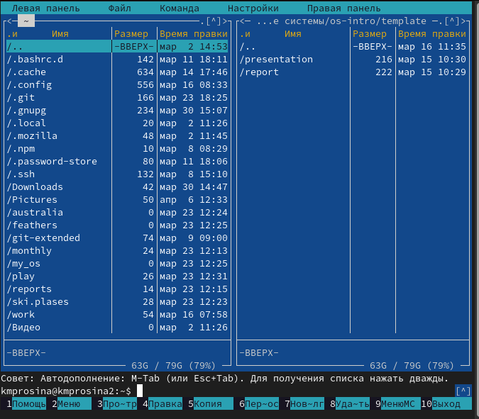
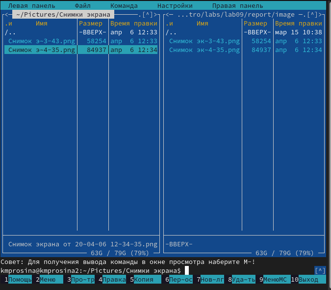
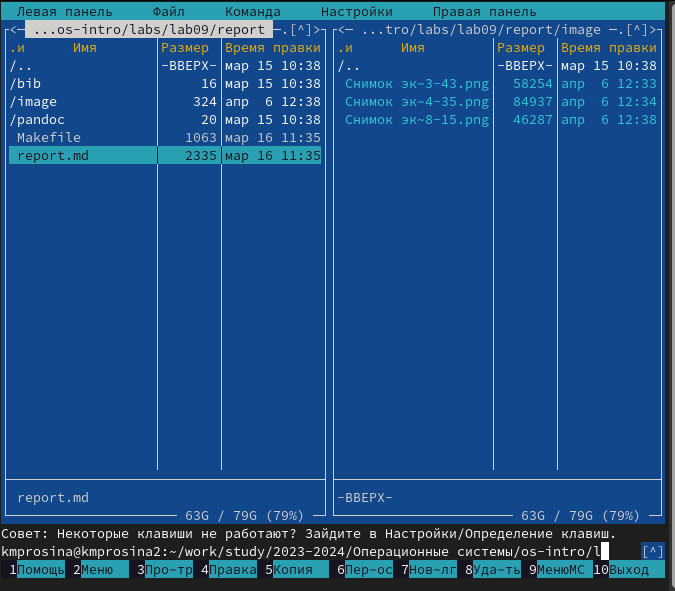
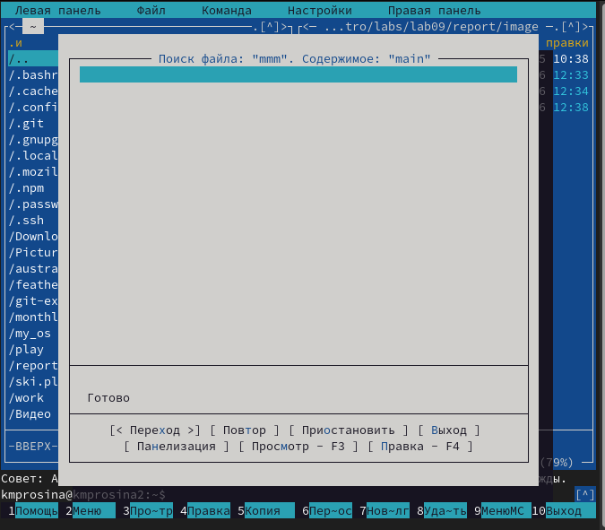
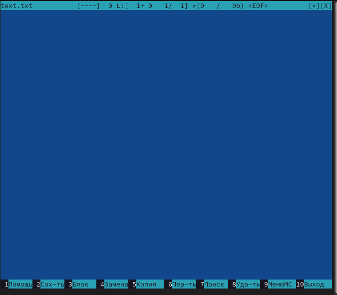
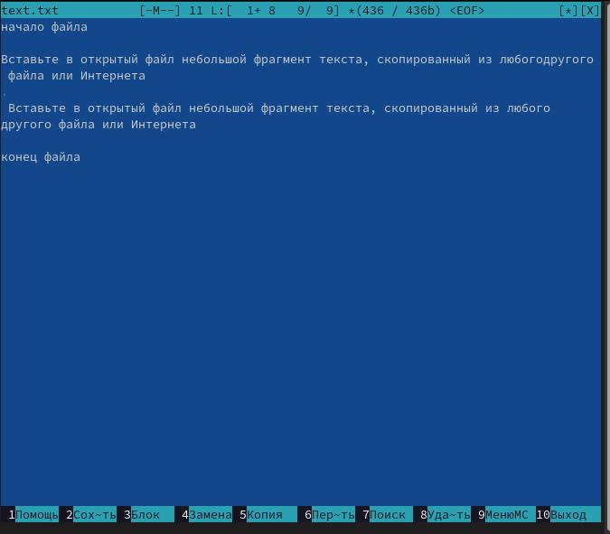
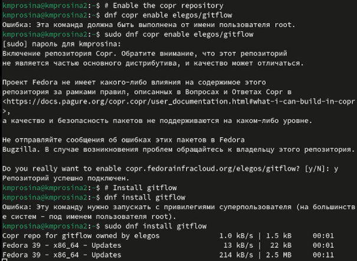

---
## Front matter
lang: ru-RU
title: Отчёт о выполнении
subtitle: Лабораторная работа № 
author:
  - Просина К. М.
institute:
  - Российский университет дружбы народов, Москва, Россия
date: 08 марта 2024

## i18n babel
babel-lang: russian
babel-otherlangs: english

## Formatting pdf
toc: false
toc-title: Содержание
slide_level: 2
aspectratio: 169
section-titles: true
theme: metropolis
header-includes:
 - \metroset{progressbar=frametitle,sectionpage=progressbar,numbering=fraction}
 - '\makeatletter'
 - '\beamer@ignorenonframefalse'
 - '\makeatother'
 ## Fonts
mainfont: PT Serif
romanfont: PT Serif
sansfont: PT Sans
monofont: PT Mono
mainfontoptions: Ligatures=TeX
romanfontoptions: Ligatures=TeX
sansfontoptions: Ligatures=TeX,Scale=MatchLowercase
monofontoptions: Scale=MatchLowercase,Scale=0.9
---

# Информация

## Докладчик

:::::::::::::: {.columns align=center}
::: {.column width="70%"}

  * Просина Ксения Максимовна
  * студентка Российского университета дружбы народов

:::
::: {.column width="30%"}
:::
::::::::::::::

# Вводная часть

## Цель работы

Освоение основных возможностей командной оболочки Midnight Commander. Приоб-
ретение навыков практической работы по просмотру каталогов и файлов; манипуляций
с ними.

# Выполнение лабораторной работы

## Задание по mc

1. Изучите информацию о mc, вызвав в командной строке man mc.

{#fig:008 width=70%}

## Выполнение лабораторной работы

2. Запустите из командной строки mc, изучите его структуру и меню.

{#fig:007 width=70%}

## Выполнение лабораторной работы

3. Выполните несколько операций в mc, используя управляющие клавиши (операции
с панелями; выделение/отмена выделения файлов, копирование/перемещение фай-
лов, получение информации о размере и правах доступа на файлы и/или каталоги
и т.п.)

{#fig:006 width=70%}

## Выполнение лабораторной работы

4. Выполните основные команды меню левой (или правой) панели. Оцените степень
подробности вывода информации о файлах.
5. Используя возможности подменю Файл , выполните:
– просмотр содержимого текстового файла;
– редактирование содержимого текстового файла (без сохранения результатов
редактирования);
– создание каталога;
– копирование в файлов в созданный каталог.

{#fig:005 width=70%}

## Выполнение лабораторной работы

6. С помощью соответствующих средств подменю Команда осуществите:
– поиск в файловой системе файла с заданными условиями (например, файла
с расширением .c или .cpp, содержащего строку main);
– выбор и повторение одной из предыдущих команд;
– переход в домашний каталог;
– анализ файла меню и файла расширений.
7. Вызовите подменю Настройки . Освойте операции, определяющие структуру экрана mc (Full screen, Double Width, Show Hidden Files и т.д.)ю

{#fig:004 width=70%}

## Задание по встроенному редактору mc

1. Создайте текстовой файл text.txt.

{#fig:003 width=70%}

## Выполнение лабораторной работы

2. Откройте этот файл с помощью встроенного в mc редактора.
3. Вставьте в открытый файл небольшой фрагмент текста, скопированный из любого
другого файла или Интернета.
4. Проделайте с текстом следующие манипуляции, используя горячие клавиши:
4.1. Удалите строку текста.
4.2. Выделите фрагмент текста и скопируйте его на новую строку.
Кулябов Д. С. и др. Операционные системы 69
4.3. Выделите фрагмент текста и перенесите его на новую строку.
4.4. Сохраните файл.
4.5. Отмените последнее действие.
4.6. Перейдите в конец файла (нажав комбинацию клавиш) и напишите некоторый
текст.
4.7. Перейдите в начало файла (нажав комбинацию клавиш) и напишите некоторый
текст.
4.8. Сохраните и закройте файл.

{#fig:002 width=70%}

## Выполнение лабораторной работы

5. Откройте файл с исходным текстом на некотором языке программирования (напри-
мер C или Java)
6. Используя меню редактора, включите подсветку синтаксиса, если она не включена,
или выключите, если она включена

{#fig:001 width=70%}

## Выводы

Освоили основные возможности командной оболочки Midnight Commander. Приоб-
рели навыки практической работы по просмотру каталогов и файлов; манипуляций
с ними.
