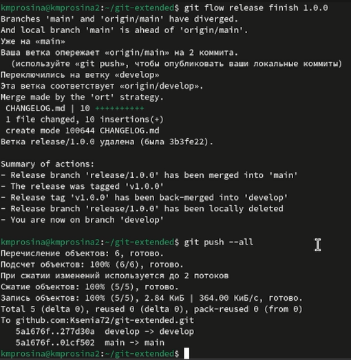
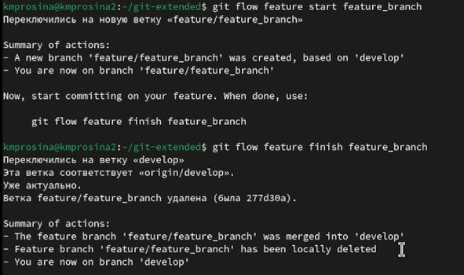
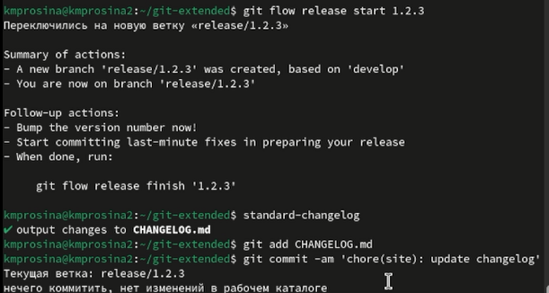

---
## Front matter
lang: ru-RU
title: Отчёт о выполнении
subtitle: Лабораторная работа № 4
author:
  - Просина К. М.
institute:
  - Российский университет дружбы народов, Москва, Россия
date: 08 марта 2024

## i18n babel
babel-lang: russian
babel-otherlangs: english

## Formatting pdf
toc: false
toc-title: Содержание
slide_level: 2
aspectratio: 169
section-titles: true
theme: metropolis
header-includes:
 - \metroset{progressbar=frametitle,sectionpage=progressbar,numbering=fraction}
 - '\makeatletter'
 - '\beamer@ignorenonframefalse'
 - '\makeatother'
 ## Fonts
mainfont: PT Serif
romanfont: PT Serif
sansfont: PT Sans
monofont: PT Mono
mainfontoptions: Ligatures=TeX
romanfontoptions: Ligatures=TeX
sansfontoptions: Ligatures=TeX,Scale=MatchLowercase
monofontoptions: Scale=MatchLowercase,Scale=0.9
---

# Информация

## Докладчик

:::::::::::::: {.columns align=center}
::: {.column width="70%"}

  * Просина Ксения Максимовна
  * студентка Российского университета дружбы народов

:::
::: {.column width="30%"}
:::
::::::::::::::

# Вводная часть

## Цель работы

- Целью лабораторной работы является получение практических навыков правильной работы с репозиториями git.

# Выполнение лабораторной работы

## Выполнение лабораторной работы

Для начала было необходимо скачать git-flow используя команды:
Enable the copr repository \
dnf copr enable elegos/gitflow \
Install gitflow \
dnf install gitflow \

{#fig:001 width=70%}

## Выполнение лабораторной работы

Далее идет установка и настройка Node.js

{#fig:002 width=70%}

## Выполнение лабораторной работы

Используем pnpm add -g commitizen для помощи в форматировании коммитов
При этом устанавливается скрипт git-cz, который мы и будем использовать для коммитов. 

{#fig:003 width=70%}

## Выполнение лабораторной работы

Подключение репозитория к github. Создали репозиторий на GitHubс названием git-extended.
Делаем первый коммит и выкладываем на github.

{#fig:004 width=70%}

## Выполнение лабораторной работы

Заполняем файл package.json согласно лабораторной работе.

{#fig:005 width=70%}

## Выполнение лабораторной работы

Добавляем новые файлы .

{#fig:006 width=70%}

## Выполнение лабораторной работы

Инициализируем git-flow и устанавливаем префикс для ярлыков v. Проверяем, что мы на ветке develop и загружаем весь репозиторий в хранилище.

{#fig:007 width=70%}

## Выполнение лабораторной работы

Устанавливаем внешнюю ветку как вышестоящую для этой ветки. Создаем релиз с версией 1.0.0 и журнал изменений. Добавляем журнал изменений в индекс.

{#fig:008 width=70%}

## Выполнение лабораторной работы

Заливаем релизную ветку в основную ветку и отправляем данные на github.

{#fig:009 width=70%}

## Выполнение лабораторной работы

Создаем релиз на github.

{#fig:010 width=70%}

## Выполнение лабораторной работы

Разработка новой функциональности
Создаем ветку для новой функциональности и продолжаем работу c git как обычно. Объединяем ветку feature_branch c develop.

{#fig:011 width=70%}

## Выполнение лабораторной работы

Создаем релиз с версией 1.2.3 и обновляем номер версии в файле package.json и журнал изменений. После этого добавляем журнал изменений в индекс

{#fig:012 width=70%}

## Выполнение лабораторной работы

Заливаем релизную ветку в основную ветку и отправляем данные на github. Далее создаем релиз на github с комментарием из журнала изменений 

{#fig:013 width=70%}

## Выводы

- Во время выполнения лабораторной работы мне удалось получить навыки правильной работы с репозиториями git.

