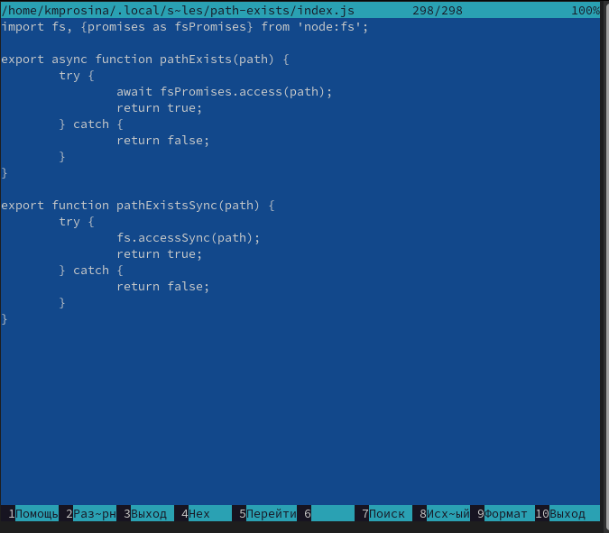
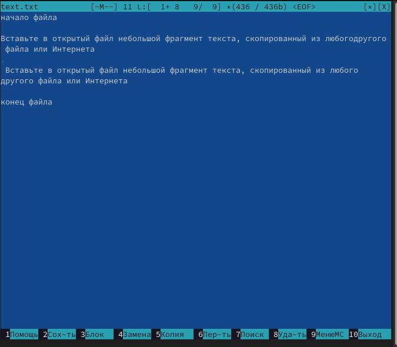
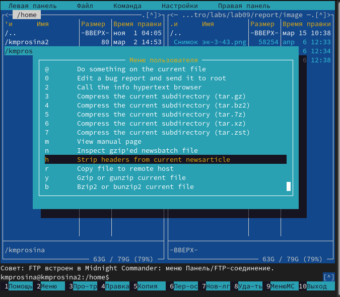
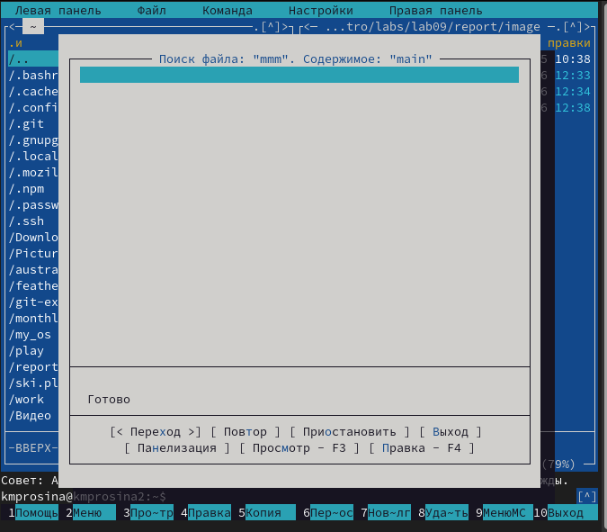
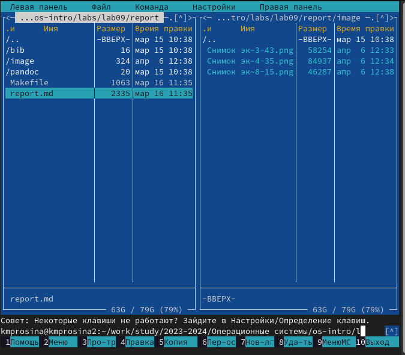
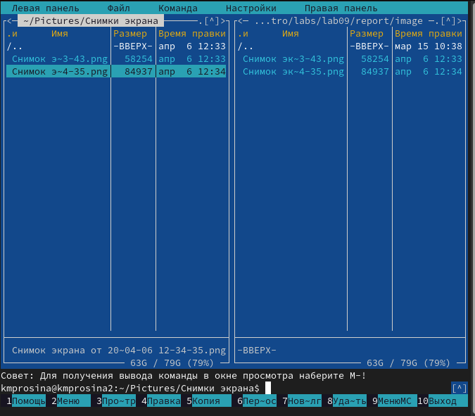
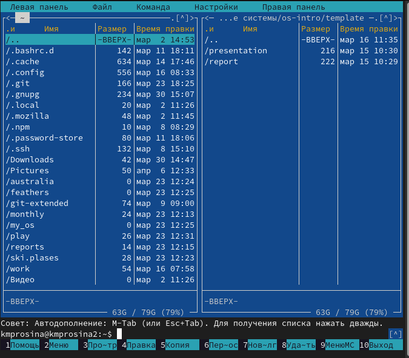
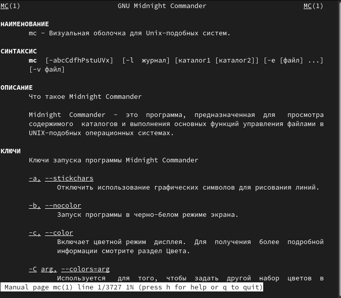
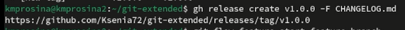
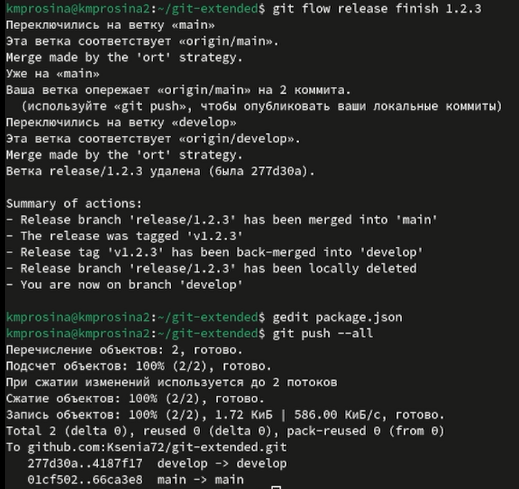

---
## Front matter
title: "Отчёт о выполнении"
subtitle: "Лабораторная работа № 4"
author: "Просина К. М."

## Generic otions
lang: ru-RU
toc-title: "Содержание"

## Bibliography
bibliography: bib/cite.bib
csl: pandoc/csl/gost-r-7-0-5-2008-numeric.csl

## Pdf output format
toc: true # Table of contents
toc-depth: 2
lof: true # List of figures
lot: true # List of tables
fontsize: 12pt
linestretch: 1.5
papersize: a4
documentclass: scrreprt
## I18n polyglossia
polyglossia-lang:
  name: russian
  options:
	- spelling=modern
	- babelshorthands=true
polyglossia-otherlangs:
  name: english
## I18n babel
babel-lang: russian
babel-otherlangs: english
## Fonts
mainfont: PT Serif
romanfont: PT Serif
sansfont: PT Sans
monofont: PT Mono
mainfontoptions: Ligatures=TeX
romanfontoptions: Ligatures=TeX
sansfontoptions: Ligatures=TeX,Scale=MatchLowercase
monofontoptions: Scale=MatchLowercase,Scale=0.9
## Biblatex
biblatex: true
biblio-style: "gost-numeric"
biblatexoptions:
  - parentracker=true
  - backend=biber
  - hyperref=auto
  - language=auto
  - autolang=other*
  - citestyle=gost-numeric
## Pandoc-crossref LaTeX customization
figureTitle: "Рис."
tableTitle: "Таблица"
listingTitle: "Листинг"
lofTitle: "Список иллюстраций"
lotTitle: "Список таблиц"
lolTitle: "Листинги"
## Misc options
indent: true
header-includes:
  - \usepackage{indentfirst}
  - \usepackage{float} # keep figures where there are in the text
  - \floatplacement{figure}{H} # keep figures where there are in the text
---

# Цель работы

Во время выполнения лабораторной работы получить навыки правильной работы с репозиториями git.

# Задание

Выполнить работу для тестового репозитория.
Преобразовать рабочий репозиторий в репозиторий с git-flow и conventional commits.

# Теоретическое введение

## Рабочий процесс Gitflow

    Общая информация

Gitflow Workflow опубликована и популяризована Винсентом Дриссеном.
Gitflow Workflow предполагает выстраивание строгой модели ветвления с учётом выпуска проекта.
Данная модель отлично подходит для организации рабочего процесса на основе релизов.
Работа по модели Gitflow включает создание отдельной ветки для исправлений ошибок в рабочей среде.
Последовательность действий при работе по модели Gitflow:
Из ветки master создаётся ветка develop.
Из ветки develop создаётся ветка release.
 Из ветки develop создаются ветки feature.
Когда работа над веткой feature завершена, она сливается с веткой develop.Когда работа над веткой релиза release завершена, она сливается в ветки develop и master.
Если в master обнаружена проблема, из master создаётся ветка hotfix.
Когда работа над веткой исправления hotfix завершена, она сливается в ветки develop и master.

Процесс работы с Gitflow
Основные ветки (master) и ветки разработки (develop)
Для фиксации истории проекта в рамках этого процесса вместо одной ветки master используются две ветки. В ветке master хранится официальная история релиза, а ветка develop предназначена для объединения всех функций. Кроме того, для удобства рекомендуется присваивать всем коммитам в ветке master номер версии.
При использовании библиотеки расширений git-flow нужно инициализировать структуру в существующем репозитории:
git flow init
Для github параметр Version tag prefix следует установить в v.
После этого проверьте, на какой ветке Вы находитесь:
git branch

    Функциональные ветки (feature)
Под каждую новую функцию должна быть отведена собственная ветка, которую можно отправлять в центральный репозиторий для создания резервной копии или совместной работы команды. Ветки feature создаются не на основе master, а на основе develop. Когда работа над функцией завершается, соответствующая ветка сливается обратно с веткой develop. Функции не следует отправлять напрямую в ветку master.
Как правило, ветки feature создаются на основе последней ветки develop.
Создание функциональной ветки
Создадим новую функциональную ветку:
git flow feature start feature_branch
Далее работаем как обычно.
Окончание работы с функциональной веткой
По завершении работы над функцией следует объединить ветку feature_branch с develop:
git flow feature finish feature_branch

    Ветки выпуска (release)
Когда в ветке develop оказывается достаточно функций для выпуска, из ветки develop создаётся ветка release. Создание этой ветки запускает следующий цикл выпуска, и с этого момента новые функции добавить больше нельзя — допускается лишь отладка, создание документации и решение других задач. Когда подготовка релиза завершается, ветка release сливается с master и ей присваивается номер версии. После нужно выполнить слияние с веткой develop, в которой с момента создания ветки релиза могли возникнуть изменения.
Благодаря тому, что для подготовки выпусков используется специальная ветка, одна команда может дорабатывать текущий выпуск, в то время как другая команда продолжает работу над функциями для следующего.
Создать новую ветку release можно с помощью следующей команды:
git flow release start 1.0.0
Для завершения работы на ветке release используются следующие команды:
git flow release finish 1.0.0

    Ветки исправления (hotfix)
Ветки поддержки или ветки hotfix используются для быстрого внесения исправлений в рабочие релизы. Они создаются от ветки master. Это единственная ветка, которая должна быть создана непосредственно от master. Как только исправление завершено, ветку следует объединить с master и develop. Ветка master должна быть помечена обновлённым номером версии.
Наличие специальной ветки для исправления ошибок позволяет команде решать проблемы, не прерывая остальную часть рабочего процесса и не ожидая следующего цикла релиза.
Ветку hotfix можно создать с помощью следующих команд:
git flow hotfix start hotfix_branch
По завершении работы ветка hotfix объединяется с master и develop:
git flow hotfix finish hotfix_branch

# Выполнение лабораторной работы

Для начала было необходимо скачать git-flow используя команды :
# Enable the copr repository \
dnf copr enable elegos/gitflow \
# Install gitflow \
dnf install gitflow \

{#fig:001 width=70%}

Далее идет установка и настройка Node.js .

{#fig:002 width=70%}

Используем pnpm add -g commitizen для помощи в форматировании коммитов
При этом устанавливается скрипт git-cz, который мы и будем использовать для коммитов. .

{#fig:003 width=70%}

## Создание репозитория git

Подключение репозитория к github. Создали репозиторий на GitHubс названием git-extended.
Делаем первый коммит и выкладываем на github .

{#fig:004 width=70%}

Заполняем файл package.json согласно лабораторной работе .

{#fig:005 width=70%}

Добавляем новые файлы .

{#fig:006 width=70%}

Конфигурация git-flow
Инициализируем git-flow и устанавливаем префикс для ярлыков v. Проверяем, что мы на ветке develop и загружаем весь репозиторий в хранилище .

{#fig:007 width=70%}

Устанавливаем внешнюю ветку как вышестоящую для этой ветки. Создаем релиз с версией 1.0.0 и журнал изменений. Добавляем журнал изменений в индекс .

{#fig:008 width=70%}

Заливаем релизную ветку в основную ветку и отправляем данные на github .

{#fig:009 width=70%}

Создаем релиз на github (рис. [-@fig:010]).

{#fig:010 width=70%}

## Работа с репозиторием git
Разработка новой функциональности
Создаем ветку для новой функциональности и продолжаем работу c git как обычно. Объединяем ветку feature_branch c develop .

{#fig:011 width=70%}

Создаем релиз с версией 1.2.3 и обновляем номер версии в файле package.json и журнал изменений. После этого добавляем журнал изменений в индекс .

{#fig:012 width=70%}

Заливаем релизную ветку в основную ветку и отправляем данные на github. Далее создаем релиз на github с комментарием из журнала изменений .

{#fig:013 width=70%}

# Выводы

Во время выполнения лабораторной работы мне удалось получить навыки правильной работы с репозиториями git.

# Список литературы{.unnumbered}

::: {#https://esystem.rudn.ru/mod/page/view.php?id=1098937}
:::
