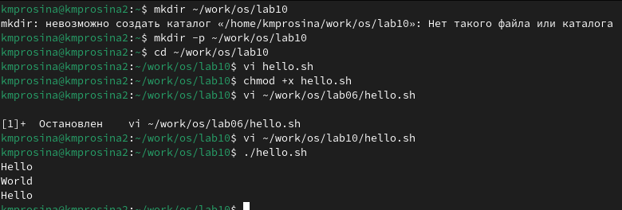

---
## Front matter
lang: ru-RU
title: Отчёт о выполнении
subtitle: Лабораторная работа № 10
author:
  - Просина К. М.
institute:
  - Российский университет дружбы народов, Москва, Россия
date: 08 марта 2024

## i18n babel
babel-lang: russian
babel-otherlangs: english

## Formatting pdf
toc: false
toc-title: Содержание
slide_level: 2
aspectratio: 169
section-titles: true
theme: metropolis
header-includes:
 - \metroset{progressbar=frametitle,sectionpage=progressbar,numbering=fraction}
 - '\makeatletter'
 - '\beamer@ignorenonframefalse'
 - '\makeatother'
 ## Fonts
mainfont: PT Serif
romanfont: PT Serif
sansfont: PT Sans
monofont: PT Mono
mainfontoptions: Ligatures=TeX
romanfontoptions: Ligatures=TeX
sansfontoptions: Ligatures=TeX,Scale=MatchLowercase
monofontoptions: Scale=MatchLowercase,Scale=0.9
---

# Информация

## Докладчик

:::::::::::::: {.columns align=center}
::: {.column width="70%"}

  * Просина Ксения Максимовна
  * студентка Российского университета дружбы народов

:::
::: {.column width="30%"}
:::
::::::::::::::

# Вводная часть

## Цель работы

Познакомиться с операционной системой Linux. Получить практические навыки рабо-
ты с редактором vi, установленным по умолчанию практически во всех дистрибутивах.

# Выполнение лабораторной работы

## Выполнение лабораторной работы

1. Ознакомиться с теоретическим материалом.
2. Ознакомиться с редактором vi.
3. Выполнить упражнения, используя команды vi.

## 8.3.1. Задание 1. Создание нового файла с использованием vi

1. Создайте каталог с именем ~/work/os/lab06.
2. Перейдите во вновь созданный каталог.
3. Вызовите vi и создайте файл hello.sh
1 vi hello.sh
4. Нажмите клавишу i и вводите следующий текст.
1 #!/bin/bash
2 HELL=Hello
3 function hello {
4 LOCAL HELLO=World
5 echo $HELLO
6 }
7 echo $HELLO
8 hello
5. Нажмите клавишу Esc для перехода в командный режим после завершения ввода
текста.
6. Нажмите : для перехода в режим последней строки и внизу вашего экрана появится
приглашение в виде двоеточия.
7. Нажмите w (записать) и q (выйти), а затем нажмите клавишу Enter для сохранения
вашего текста и завершения работы.
8. Сделайте файл исполняемым
1 chmod +x hello.sh

## Задание 2. Редактирование существующего файла

1. Вызовите vi на редактирование файла
1 vi ~/work/os/lab06/hello.sh
2. Установите курсор в конец слова HELL второй строки.
3. Перейдите в режим вставки и замените на HELLO. Нажмите Esc для возврата в команд-
ный режим.
4. Установите курсор на четвертую строку и сотрите слово LOCAL.
5. Перейдите в режим вставки и наберите следующий текст: local, нажмите Esc для
возврата в командный режим.
6. Установите курсор на последней строке файла. Вставьте после неё строку, содержащую
следующий текст: echo $HELLO.
7. Нажмите Esc для перехода в командный режим.
8. Удалите последнюю строку.
9. Введите команду отмены изменений u для отмены последней команды.
10. Введите символ : для перехода в режим последней строки. Запишите произведённые
изменения и выйдите из vi.

{#fig:001 width=70%}

## Выводы

Познакомились с операционной системой Linux. Получили практические навыки рабо-
ты с редактором vi, установленным по умолчанию практически во всех дистрибутивах.

