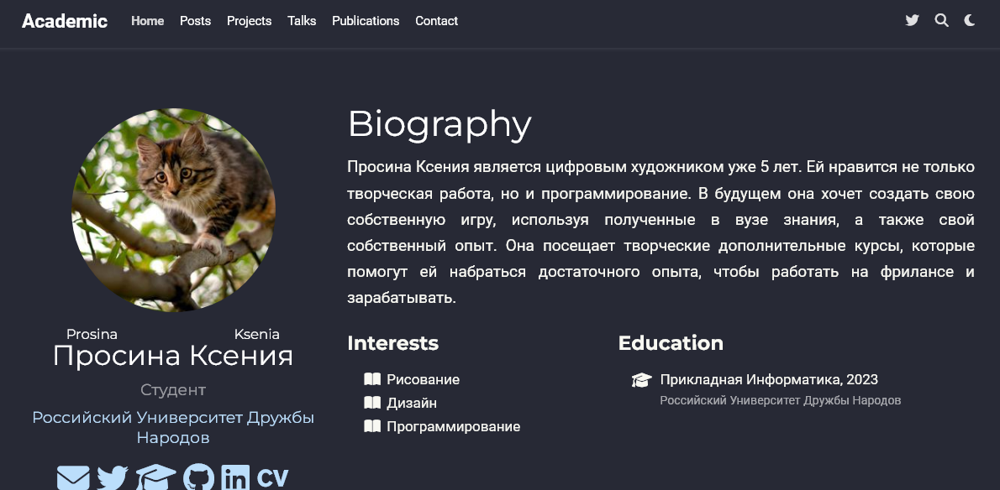
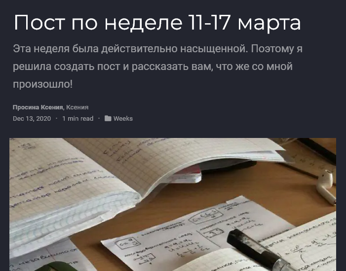

---
## Front matter
lang: ru-RU
title: Отчёт о выполнении
subtitle: Лабораторная работа № 
author:
  - Просина К. М.
institute:
  - Российский университет дружбы народов, Москва, Россия
date: 08 марта 2024

## i18n babel
babel-lang: russian
babel-otherlangs: english

## Formatting pdf
toc: false
toc-title: Содержание
slide_level: 2
aspectratio: 169
section-titles: true
theme: metropolis
header-includes:
 - \metroset{progressbar=frametitle,sectionpage=progressbar,numbering=fraction}
 - '\makeatletter'
 - '\beamer@ignorenonframefalse'
 - '\makeatother'
 ## Fonts
mainfont: PT Serif
romanfont: PT Serif
sansfont: PT Sans
monofont: PT Mono
mainfontoptions: Ligatures=TeX
romanfontoptions: Ligatures=TeX
sansfontoptions: Ligatures=TeX,Scale=MatchLowercase
monofontoptions: Scale=MatchLowercase,Scale=0.9
---

# Информация

## Докладчик

:::::::::::::: {.columns align=center}
::: {.column width="70%"}

  * Просина Ксения Максимовна
  * студентка Российского университета дружбы народов

:::
::: {.column width="30%"}
:::
::::::::::::::

# Вводная часть

## Цель работы

Научиться редактировать информацию на сайте

# Выполнение лабораторной работы

## Выполнение лабораторной работы

Добавить к сайту данные о себе.

Список добавляемых данных.
Разместить фотографию владельца сайта.

{#fig:001 width=70%}

## Выполнение лабораторной работы

Разместить краткое описание владельца сайта (Biography).
Добавить информацию об интересах (Interests).
Добавить информацию от образовании (Education).

{#fig:002 width=70%}

## Выполнение лабораторной работы

Сделать пост по прошедшей неделе.

{#fig:003 width=70%}

{#fig:004 width=70%}

## Выполнение лабораторной работы

Добавить пост на тему по выбору:
Управление версиями. Git.

{#fig:005 width=70%}

## Выводы

Во время выполнения индивидуального проекта мне удалось научиться редактировать информацию на сайте
